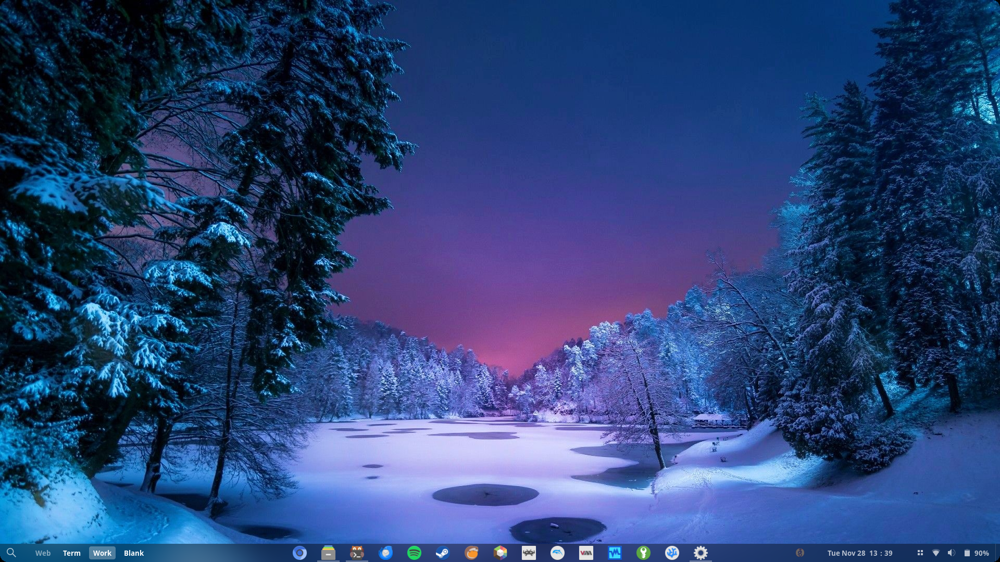
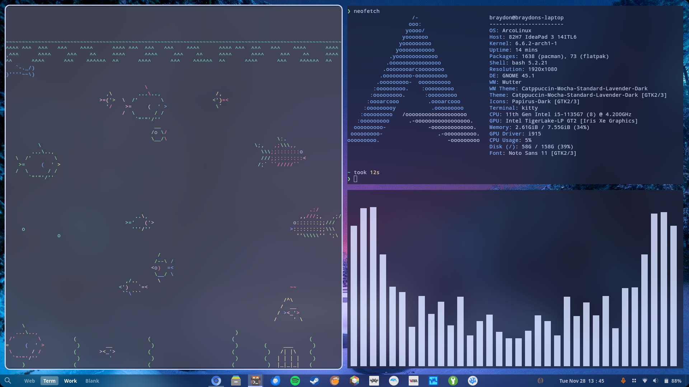
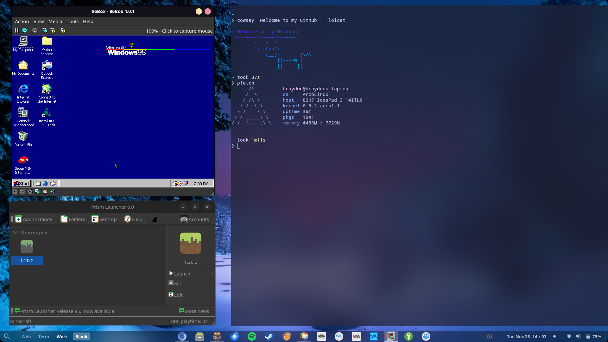
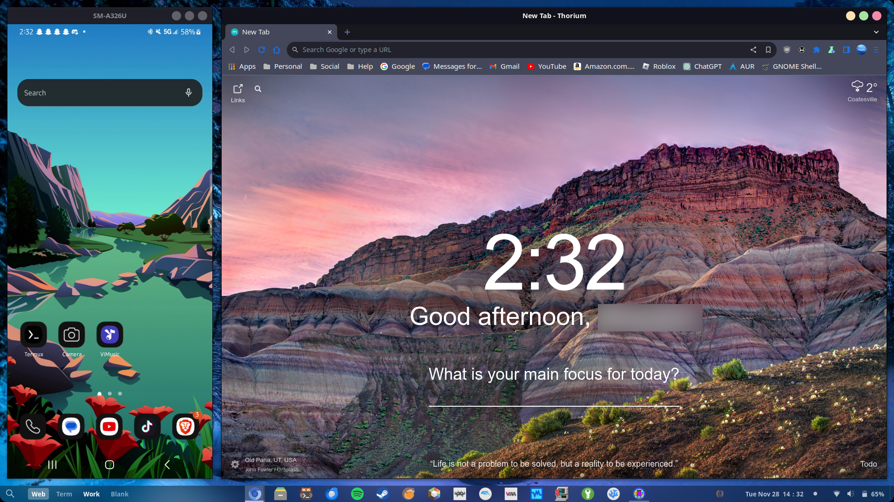

# Dotfiles
<a href='https://www.madz258.xyz'> Visit My Website! </a>

Hi these are the configs for my Gnome and Hyprland Desktops

# GNOME
I am currently running GNOME on arcolinux but are making plans to try out Hyprland

# Preview

My extensions for GNOME are
<a href='https://extensions.gnome.org/extension/4481/forge/'> Forge </a>
 
<a href='https://extensions.gnome.org/extension/3628/arcmenu/'> ArcMenu </a>
 
<a href='https://extensions.gnome.org/extension/1160/dash-to-panel/'> Dash to Panel </a>
 
<a href='https://extensions.gnome.org/extension/3193/blur-my-shell/'> Blur My Shell </a>
 
<a href='https://extensions.gnome.org/extension/5090/space-bar/'> Space Bar </a>
 
<a href='https://extensions.gnome.org/extension/1514/rounded-corners/'> Rounded Corners </a>
 
<a href='https://extensions.gnome.org/extension/5362/wireguard-vpn-extension/'> Wireguard VPN Extension </a>
 
